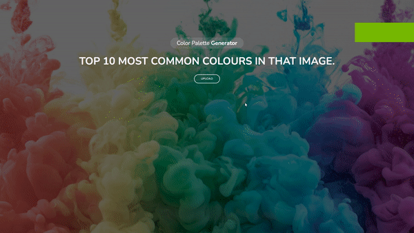

# Color Pallette Generator :mage:

### Project Objective

This project was about creating a web app that extracts the top 10 colors from a given image, also allowing the user to copy color in RGB format by clicking on the desired color, this project required working with colorthief python package.

#### Used Tech
- HTML 
- CSS
- Vanilla JavaScript
- Python (Flask)

### Demo

